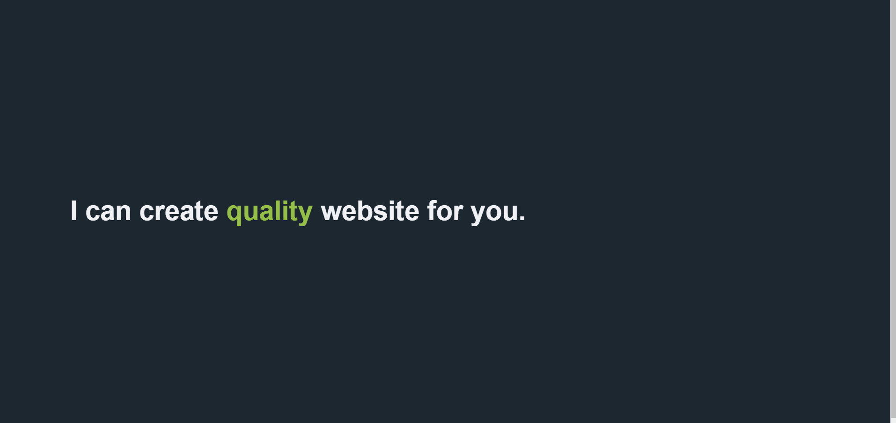

# Interactive Text Animation

## Description
This project demonstrates a text animation where a word within a sentence changes periodically. The animation uses the `view-transition` API to create smooth transitions between words.

## Features
- **Text Animation:** Words in the text change dynamically every 1.5 seconds.
- **Smooth Transitions:** Uses CSS `view-transition` API for smooth transitions between words.
- **Responsive Design:** The font size adjusts based on the viewport width.

